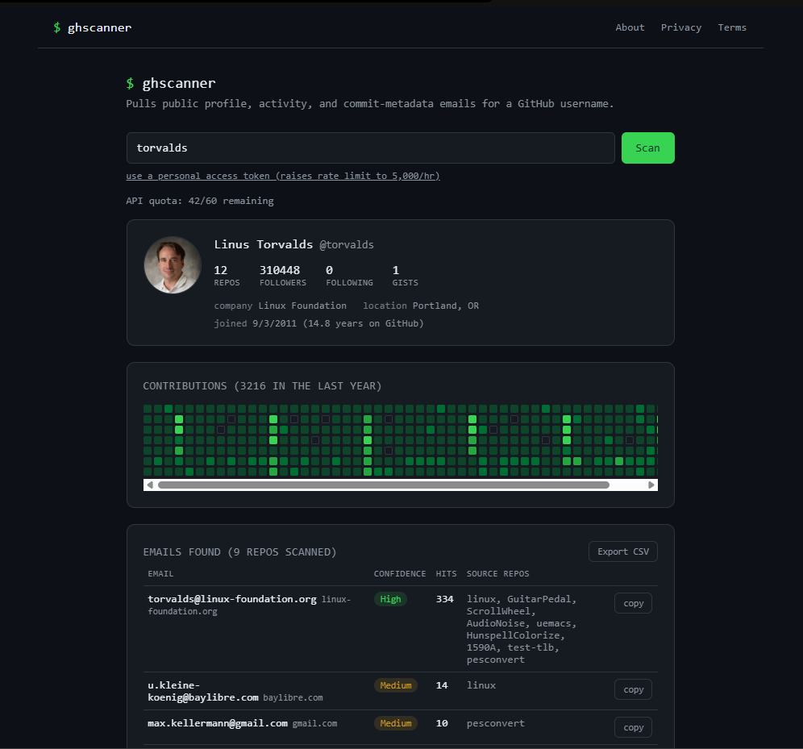

# ghscanner [ beta ]

ghscanner is a simple tool that looks up a GitHub username and shows what's publicly visible about that account: profile info, activity, contribution history, and any email addresses left in public commit metadata.



## Why I built this?

Well, when I do some OSINT stuff, it's hard to find email IDs because lots of users on GitHub make it private. The thing is that before making it private, many users (including me) pushed code using their own personal email ID. It isn't a big security issue, but for looking these from GitHub OSINT purposes would take hours. Many tools available on the internet (web-based) don't work perfectly, showing no-reply email, "could not find email," and bla bla stuff. So I built this instead.

## Setup is simple

```bash
npm install
npm run dev      # local dev server
npm run build    # production build -> dist/
```

## How it works?

ghscanner leverages GitHub's public API and scrapes commit metadata to find email addresses that users may have accidentally exposed through their commit history. Here's the process:

- **Fetch User Profile** - Retrieves public profile information
- **Scan Commit History** - Analyzes public commit data across repositories to extract email addresses from commit metadata
- **Filter & Validate** - Filters out GitHub's noreply email addresses and validates real email formats
- **Display Results** - Presents all found information in a clean, organized interface
- **Download** - you can download all results in csv format as well.
## Disclaimer

This tool is built for **educational and OSINT research purposes only**. All information gathered is publicly available on GitHub. Always respect:

- GitHub's Terms of Service
- Individual privacy rights
- Ethical guidelines for OSINT

**Don't use this tool for:**

- Send unsolicited bulk email (spam) to addresses found here.
- Harass, stalk, or dox any individual.
- Attempt to bulk-scrape, enumerate, or automate lookups against many usernames.
- Circumvent GitHub's own rate limits or terms of service.

## Contributing

Contributions are welcome! Please:

1. Fork the repository
2. Create a feature branch (`git checkout -b feature/yourpreferednamehere`)
3. Commit changes (`git commit -m 'Add name here'`)
4. Push to branch (`git push origin feature/name here`)
5. Open a Pull Request

## License

Distributed under the MIT License. See `LICENSE` file for more information.

## Acknowledgments

- GitHub for providing the API
- [github-contributions-api.jogruber.de](https://github-contributions-api.jogruber.de)

## Contact

**Surajit S.** - [@getsensurajit](https://twitter.com/getsensurajit) - sensurajit@proton.me

Project Link: [https://github.com/blackxploit-404/ghscanner](https://github.com/blackxploit-404/ghscanner)

---

**Happy OSINTing! 🔍**
